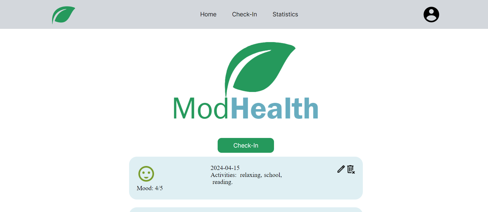

# ModHealth (Senior Project)

## Mockup/Storyboard
https://www.figma.com/file/kuSjl1UbBwiUXkxhBDq8kj/Mood-Tracker-Senior-Project-Web-App?type=design&mode=design&t=USLcERzqgkj4Cgbw-1

## Resources
###### Entries
Attributes:
- string (date to string YYYY-MM-DD)
- Mood (integer)
- journal (journalSchema)
- Activity Tag (list of strings)

#
Rest Endpoints
|Name | Method | Path |
|-----|--------|------|
| getEntries | GET | /entries |
| createEntry | POST | /entries |
| saveEditEntries | PUT | /entries/id |
| deleteEntry | DELETE | /entries/id |
| getStats | GET | /stats |

#
Additional Notes:
- Statistics Page(GET date(s), mood, activity tags from getEntries)
- Testing with Jest and Supertest
- Frontend Built with Vuejs
- Backend Built with Nodejs, Expressjs, using Mongoose with MongoDB

## Images

